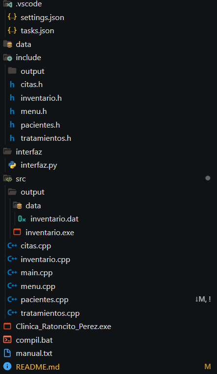

# 🦷 Clínica Dental "Ratoncito Pérez" - Sistema de Administración

Este es un sistema de administración para clínicas dentales desarrollado en C++, que permite gestionar pacientes, tratamientos, citas y medicamentos utilizando archivos binarios.

---

## 📌 Características principales

- Gestión de pacientes (agregar, buscar, editar)
- Control de citas
- Registro de tratamientos dentales
- Inventario de medicamentos
- Interfaz sencilla mediante consola
- Archivos binarios para almacenamiento de datos

---

## ⚙️ Tecnologías usadas

- Lenguaje: C++
- Compilador recomendado: `g++` (con MinGW)
- Editor sugerido: Visual Studio Code o Dev-C++
- Sistema operativo compatible: Windows

---

## 🚀 Cómo ejecutar el sistema

1. Clona o descarga este repositorio.
2. Abre la carpeta del proyecto en tu editor.
3. Ejecuta el archivo `compile.bat` (doble clic o desde la terminal).
4. Abre el ejecutable generado: `Clínica_Ratoncito_Perez.exe`.
5. Navega por el menú usando los números correspondientes.

> Todos los datos se guardan automáticamente en archivos binarios dentro de `src/output/data`.

---

## 🧠 Estructura del proyecto

## 🧑‍💻 Autores

- Alisson (Coordinadora)
- Maynor  (Colaborador)
- Brayan  (Colaborador)
- Fernando (Colaborador)
- Saúl (Colaborador)

## 📄 Licencia

Proyecto educativo desarrollado para Universidad de El Salvador, Facultad Multidisciplinaria de Occidente, Ingeniería en Desarrollo de Software.
